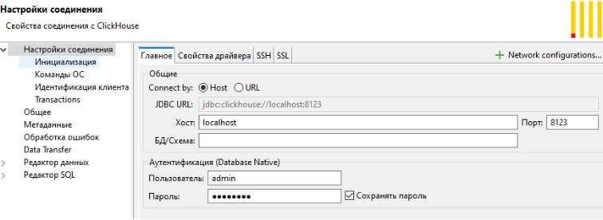
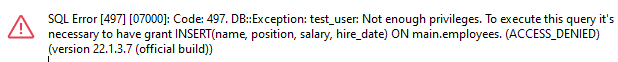

**Задание 3.**

**Создание Docker-контейнера с ClickHouse и SQL**
**

**Цель: Научиться разворачивать ClickHouse в Docker, создавать базы данных и настраивать роли с разными правами доступа с помощью SQL-запросов через DBeaver.**

Описание задания:

- Создайте директорию для проекта и необходимые файлы.
- В файле docker-compose.yml опишите конфигурацию для запуска контейнера с ClickHouse.
- Если у вас еще не установлен DBeaver, скачайте и установите его.
- В DBeaver, используя SQL-редактор, выполните SQL-запрос для создания базы данных test.
- Аналогично создайте базу данных main.
- В базе данных main создайте роль с правами на чтение.
- Создайте роль с правами на запись в БД main.
- Для проверки создайте пользователя, назначьте ему одну из созданных ролей и сделайте простой запрос к БД, подтверждающий, что роль работает корректно. Сделайте скриншот.

Результат задания — после выполнения задания у вас будет развернутый в Docker ClickHouse, две базы данных (test и main) и настроенные роли для управления доступом к базе данных main. Вы можете подключаться к ClickHouse через DBeaver и выполнять SQL-запросы для настройки прав доступа.

########################## docker-compose.yml ###################################

version: '3.8'

services:

`  `clickhouse:

`    `image: yandex/clickhouse-server:latest

`    `container\_name: clickhouse

`    `environment:

`      `CLICKHOUSE\_USER: admin

`      `CLICKHOUSE\_DEFAULT\_ACCESS\_MANAGEMENT: 1

`      `CLICKHOUSE\_PASSWORD: password

`    `ports:

`      `- "8123:8123" # HTTP-интерфейс

`      `- "9000:9000" # TCP-интерфейс для клиентов

`    `# volumes:

`    `#   - ./data:/var/lib/clickhouse

`    `#   - ./config:/etc/clickhouse-server

`    `restart: unless-stopped

###############################################################################

mkdir data

mkdir config

docker-compose up -d

Запустить DBeaver, подключиться к clickhouse

-----
**Создаем базы данных test и main**

CREATE DATABASE test;

CREATE DATABASE main;

-----
**Создаем роли с правами доступа**

- **Роль с правами на чтение**

CREATE ROLE read\_only;

GRANT SELECT ON main.\* TO read\_only;

- **Роль с правами на запись**

CREATE ROLE write\_access;

GRANT INSERT, SELECT ON main.\* TO write\_access;

- **Создаем таблицу для тестов**

CREATE TABLE main.employees (

`    `name String,

`    `position String,

`    `salary Float64,

`    `hire\_date Date

) ENGINE = MergeTree()

ORDER BY hire\_date;

INSERT INTO main.employees (name, position, salary, hire\_date) VALUES

('Alice', 'Engineer', 75000, '2021-06-15'),

('Bob', 'Manager', 90000, '2020-05-01'),

('Charlie', 'HR', 60000, '2019-04-12'),

('Diana', 'Sales', 50000, '2018-01-25');

-----
**Создаем пользователя и назначаем роль**

CREATE USER test\_user IDENTIFIED BY 'password123';

- Назначаем пользователю роль на чтение:

GRANT read\_only TO test\_user;

-----
**Проверяем права доступа**

- Подключаемся к ClickHouse через DBeaver под учетной записью test\_user 

SELECT \* FROM main.table\_name;

пробуем выполнить запрос на запись, чтобы убедиться в ограничении прав:

INSERT INTO main.employees (name, position, salary, hire\_date) VALUES

('Petr', 'Engineer', 65000, '2021-08-11');

